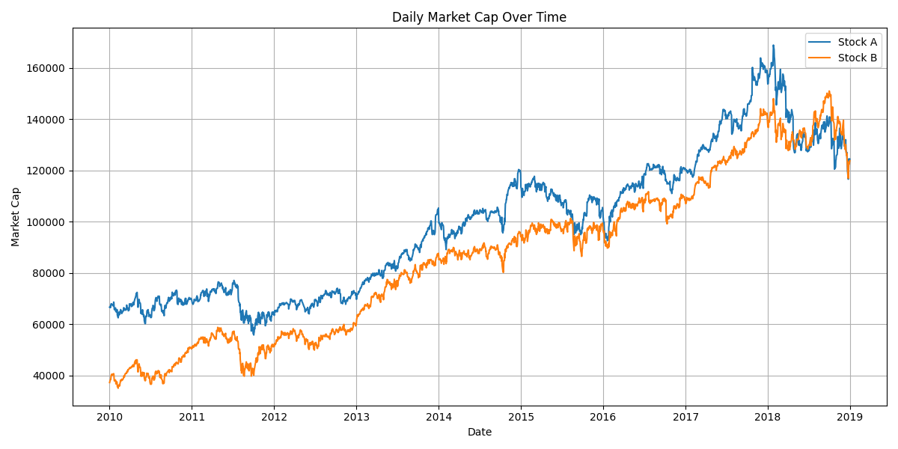

# Aspire Data Engineering Task

## Overview
This repository contains the solution for the Aspire Data Engineering task. The task involves data extraction, transformation, and analysis of stock market data. The project is structured to handle data processing using both ELT (Extract, Load, Transform) and ETL (Extract, Transform, Load) pipelines. The results are saved in CSV files and plots for visualization.

## Setup Instructions

### 1. Clone the Repository
Clone the repository to your local machine:
```sh
git clone https://github.com/notcostheta/aspire-data-engineering
```

### 2. Navigate to the Project Directory
Change to the project directory:
```sh
cd aspire-data-engineering
```

### 3. Create a Virtual Environment
Create a virtual environment to manage dependencies:
```sh
python -m venv .venv
```

### 4. Activate the Virtual Environment
Activate the virtual environment:
- On Windows:
    ```sh
    .venv\Scripts\activate
    ```
- On macOS/Linux:
    ```sh
    source .venv/bin/activate
    ```

### 5. Install Dependencies
Install the required Python packages:
```sh
pip install -r requirements.txt
```

### 6. Copy the Base Excel File
Copy the base Excel file to the root directory, and rename it to `assessment.xlsx`.

## Running the Scripts

### 1. Run the Data Extraction Script
Execute the main script to perform data extraction and processing:
```sh
python main.py
```

## Data Extraction
The data extraction script is located in [`main.py`](main.py). It reads data from excel file in the root directory, and extracts data from all the sheets.
Make sure to copy the base Excel file to the root directory and rename it to `assessment.xlsx`.

### 2. Run the SQL Queries
Can be done in the juptyer notebook [`sql_testing.ipynb`](sql_testing.ipynb) or directly in the database.
The database is stored in a SQLite file [`transactions.db`](data/transactions.db).
Make sure the run the notebook, so that the transactions.db file is created.

## SQL Queries
The SQL queries for data transformation are located in the `sql/` directory:
- [`elt_adoption_query.sql`](sql/elt_adoption_query.sql)
- [`elt_usage_query.sql`](sql/elt_usage_query.sql)
- [`etl_adoption_query.sql`](sql/etl_adoption_query.sql)
- [`etl_usage_query.sql`](sql/etl_usage_query.sql)

The two versions of the queries are for the two different data transformation processes: ELT and ETL. The core functionality of the queries is the same, but the parsing of the payload JSON is done at different stages of the pipeline.

I've also included the queries in the Jupyter notebook [`sql_testing.ipynb`](sql_testing.ipynb) for testing.

### ELT vs ETL
- **ELT (Extract, Load, Transform)**: The data is loaded into the database first and then transformed within the database.
- **ETL (Extract, Transform, Load)**: The data is transformed before being loaded into the database.

Given the assumption that we will be doing an ELT pipeline, the submission Excel would contain the ELT queries.

## Outputs
The results of the data analysis are saved in the `outputs/` directory:

### 1. Monthly Average Market Capitalization
- **File**: [`monthly_avg_market_cap.csv`](outputs/monthly_avg_market_cap.csv)
- **Description**: Includes the monthly average market capitalization of the stocks, for subpoint two of the evaluation task.

### 2. Stock Analysis Results
- **File**: [`stock_analysis_results.csv`](outputs/stock_analysis_results.csv)
- **Description**: Includes the daily market cap and percentage change of the stocks, for subpoint one and three of the evaluation task.

## Plots
Generated plots are saved in the `plots/` directory:

### Daily Market Capitalization
- **File**: [`daily_market_cap.png`](plots/daily_market_cap.png)
- **Description**: A plot of the daily market capitalization of the stocks.

